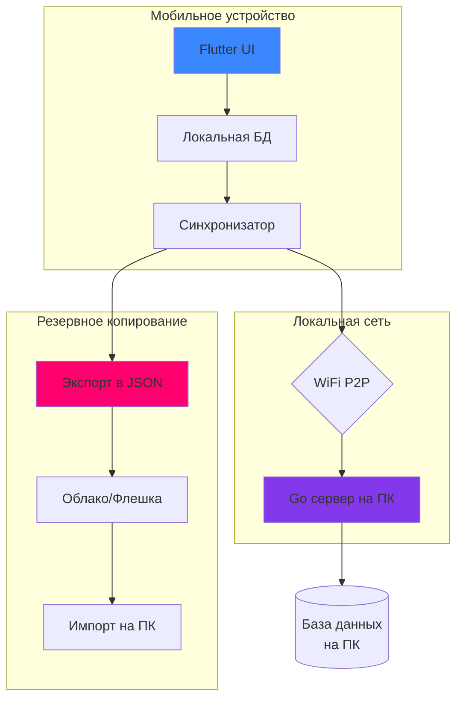

<!-- ЛОГО и заголовок -->
<div align="center">

# SYNAPSE

  

  ### Ваш персональный Obsidian в кармане


*Мобильное приложение для заметок с графом связей и локальной синхронизацией*

[📱 Особенности](#-особенности) • [🚀 Быстрый старт](#-быстрый-старт) • [📸 Скриншоты](#-скриншоты) • [🏗️ Архитектура](#%EF%B8%8F-архитектура) • [🎓 Для диплома](#-для-диплома)

</div>

---

## 📱 **Особенности**

| Функция | Описание | Статус |
|---------|----------|--------|
| **📝 Умный редактор** | Markdown + [[вики-ссылки]] как в Obsidian | 🔄 В разработке |
| **🕸️ Граф знаний** | Визуализация связей между заметками | 🔄 В разработке |
| **🔗 Авто-линковка** | AI предлагает связи между заметками | 🔄 В разработке |
| **📡 Локальная синхронизация** | P2P между телефоном и компьютером | 🔄 В разработке |
| **💾 Файловый бэкап** | Экспорт/импорт через JSON | 🔄 В разработке |
| **🌐 Кроссплатформенность** | Android, iOS, Web, Windows | 🔄 В разработке |

---

## 🚀 **Быстрый старт**

### **Для пользователей:**
1. **Скачайте APK** из [Releases](https://github.com/ваш-username/Synapse/releases)
2. **Установите** на Android устройство
3. **Начните создавать** заметки с [[вики-ссылками]]

### **Для разработчиков:**
```bash
# 1. Клонируйте репозиторий
git clone https://github.com/ваш-username/Synapse.git
cd Synapse

# 2. Запустите flutter приложение
cd client
flutter pub get
flutter run

# 3. Запустите Go сервер (опционально)
cd ../server
go run cmd/api/main.go
```

**Системные требования:**
- Flutter 3.0+ 
- Android SDK 34+ (для сборки)
- Go 1.21+ (для сервера)

---

## 📸 **Скриншоты**

<div align="center">

| Редактор заметок | Граф связей | Синхронизация |
|:---:|:---:|:---:|
|  |  |  |
| *Редактор с [[вики-ссылками]]* | *Визуализация связей* | *Локальная синхронизация* |

В РАЗРАБОТКЕ

</div>

## 🏗️ **Архитектура**



**Ключевые компоненты:**
- **Frontend**: Flutter (Dart) - кроссплатформенный UI
- **Backend**: Go - легковесный сервер синхронизации
- **База данных**: SQLite (мобильное) + PostgreSQL (опционально на ПК)
- **Синхронизация**: WebSocket (real-time) + HTTP REST (бэкап)

---

## 🎓 **Для диплома**

### **Научная новизна:**
1. **Двойная синхронизация** - P2P + файловый бэкап
2. **Локальность данных** - полная конфиденциальность
3. **Гибридный подход** - мобильное приложение + десктоп сервер

### **Демонстрация:**
```
1. Создание заметки на телефоне
   ↓
2. Автоматическая синхронизация с ПК
   ↓  
3. Визуализация в графе знаний
   ↓
4. Файловый экспорт как запасной вариант
```

### **Технический стек:**
```yaml
frontend:
  framework: Flutter 3.0
  state_management: Provider
  database: Hive/SQLite
  graph_visualization: GraphView

backend:
  language: Go 1.21
  protocols: WebSocket, HTTP REST
  database: SQLite/PostgreSQL
  p2p: LAN discovery

devops:
  ci_cd: GitHub Actions
  build: Flutter APK + Go binary
  docs: OpenAPI 3.0

